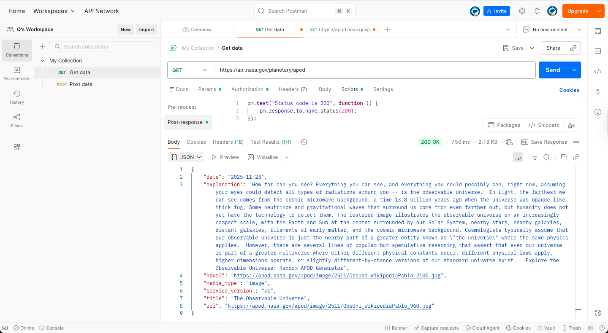
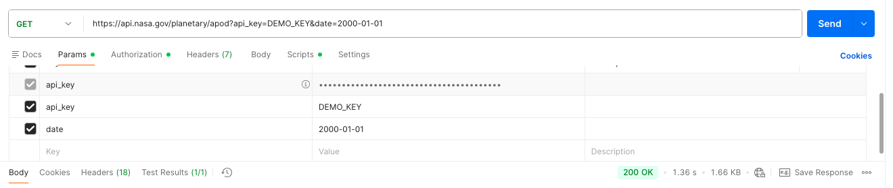

# Visualizing Space Data: A Guide to the NASA APOD API

**Author:** Q <br>
**Topic:** REST APIs, JSON, STEM <br>
**Level:** Beginner <br>
**Time:** 10 Minutes

## Introduction

The NASA **Astronomy Picture of the Day (APOD)** API is one of the most popular open-source endpoints for developers. It serves structured JSON data containing high-resolution space imagery and astronomer-written explanations.

In this tutorial, we will use **Postman** to send a `GET` request to the NASA server and retrieve dynamic space content.

## Prerequisites

- **Postman** (Desktop or Web)
- **NASA API Key** (We will generate this in Step 1)

---

## Step 1: Generate an API Key

While NASA allows demo queries, a dedicated key ensures higher rate limits.

1.  Navigate to [api.nasa.gov](https://api.nasa.gov/).
2.  Fill out the "Generate API Key" form (First Name, Last Name, Email).
3.  Copy your generated **API Key** immediately.
    - _Example format:_ `jK14...xY2`

## Step 2: Configure the Request in Postman

1.  Open Postman and create a new **Collection** named `NASA Space Data`.
2.  Add a new **Request** named `Get APOD`.
3.  Set the HTTP method to **GET**.
4.  Enter the endpoint URL:
    ```
    https://api.nasa.gov/planetary/apod
    ```

## Step 3: Authenticate

1.  Navigate to the **Params** tab (next to Authorization).
2.  Add a new query parameter:
    - **Key:** `api_key`
    - **Value:** `[Paste your NASA Key here]`
3.  _Optional:_ Add a `date` parameter (YYYY-MM-DD) to fetch a specific image from the past (e.g., your birthday).

## Step 4: Analyze the Response

Click **Send**. You should receive a `200 OK` status and a JSON object like this:



```json
{
  "date": "2025-11-23",
  "explanation": "How far can you see? Everything you can see...",
  "hdurl": "https://apod.nasa.gov/apod/image/2511/ObsUni_WikipediaPablo_2100.jpg",
  "media_type": "image",
  "title": "The Observable Universe"
}
```

## The Result

Here is the high-resolution image derived from the `hdurl` field in our JSON response: <br>

 <br>

## Bonus: Time Travel with Parameters

As mentioned in Step 3, adding the date key allows us to fetch historical data. Here is the result when we set the date to `2000-01-01` `(The Millennium)`:

`Request`:
`GET` https://api.nasa.gov/planetary/apod?api_key=DEMO_KEY&date=2000-01-01



```json
{
  "date": "2000-01-01",
  "explanation": "Welcome to the millennial year ...",
  "hdurl": "https://apod.nasa.gov/apod/image/0001/flammarion_halfcolor.gif",
  "media_type": "image",
  "service_version": "v1",
  "title": "The Millennium that Defines Universe"
}
```
<br>

